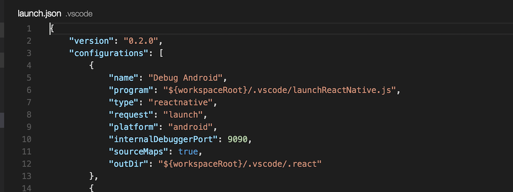

# React Native Tools
[](https://travis-ci.org/Microsoft/vscode-react-native)

This extension provides a development environment for React Native projects.
You can debug your code, quickly run `react-native` commands from the command palette and use IntelliSense to browse objects, functions and parameters for React Native APIs.


## Getting started

* [Install VS Code](https://code.visualstudio.com) (0.10.10+ is preferred).
* [Install the extension](https://code.visualstudio.com/docs/editor/extension-gallery) in VS Code:
  1. Type `F1`, then `ext install` + `Enter`, wait a moment while the list of available extensions is populated
  2. Type `react-native` and select **React Native Tools**
  3. For more guidance view [VS Code Extension Gallery](https://code.visualstudio.com/docs/editor/extension-gallery)
* If you haven't already, install React Native:
  1. Run `npm install -g react-native-cli` to install React Native CLI (0.1.10+)
  2. Set up React Native (0.19+) using the steps detailed on the React Native [getting started documentation ](https://facebook.github.io/react-native/docs/getting-started.html)
* Open your React Native project root folder in VS Code.
  * Hint: you should create a `.babelrc` with `sourceMaps = true` and `"presets": [ "react-native" ]` for better source-mapping support. (**required if you want TypeScript support**)

### Create a `.babelrc` file for ReactNative Packager transformer
  Create a `.babelrc` file in your React Native project root, the content of `.babelrc` at least with `sourceMaps = true`.
  for example:
  ```
{
  "presets": [
    "react-native" // this is required for debugging with react-native/packager/transformer
  ],
  "plugins": [],
  "sourceMaps": true // must be true react-native/packager/transformer using with node-module-debug
  // because of some bugs from vscode-node-debug & vscode-react-native, "sourceMaps" cannot be "inline" or "both"
}
  ```
  ** This is a requirement step if you want to debug with TypeScript. **

### Setup debug environment

Click the debugging icon  in the View bar, and then click the configure gear icon  to choose the React Native debug environment.


VS Code will generate a `launch.json` in your project with some default configurations such as shown below.



You can modify these configurations or add new ones to the list. You can use other fields in these configurations as well.

For example, you can modify the `target` field to specify the simulator you want to target for iOS debugging.

### Start debug session
To start the debug session, select a configuration from the Configuration dropdown, and then click the start button  (or press F5).


You can debug your app on an Android emulator, Android device or iOS simulator. This extension provides [experimental support](#debugging-on-ios-device) for iOS devices.

More information about debugging using VS Code can be found in this [guide](https://code.visualstudio.com/docs/editor/debugging).

#### Debugging on iOS device
Debugging on iOS device would require following manual steps.
* You need to install [ideviceinstaller](https://github.com/libimobiledevice/ideviceinstaller) `brew install ideviceinstaller`
* In your launch.json file, set target to "device"
* Change the `jsCodeLocation` IP in your app using the steps detailed [here](https://facebook.github.io/react-native/docs/running-on-device-ios.html#accessing-development-server-from-device).
* Choose **Debug iOS** configuration from the Configuration dropdown and press F5.
* Shake the device to open development menu and select "Debug in Chrome".

## Using React Native commands in the Command Palette

In the Command Palette, type ```React Native``` and choose a command.


The **Run Android** command triggers ```react-native run-android``` and starts your app for android.

The **Run iOS** command similarly triggers ```react-native run-ios``` and starts your app in iOS simulator (iPhone 6).

The **Packager** commands allow you to start/stop the [**React-packager**](https://github.com/facebook/react-native/tree/master/packager).

## Using IntelliSense

IntelliSense helps you discover objects, functions, and parameters in React Native.


### Enabling IntelliSense
* **Note:** This section relates to older versions of VS Code and React Native Tools. The latest version of VS Code (0.10.10+) natively supports IntelliSense for Salsa. These instructions apply to older versions of VS Code (<= 0.10.9).
    * When using VS Code 0.10.10+ with a newer React Native Tools extension (> 0.1.0) the extension will update project settings to remove the workaround described below if it was applied while using an older version of this extension or VS Code.

React Native IntelliSense depends on experimental features to support JSX in VS Code.
To enable these experimental features, you will see the following prompt immediately after opening a React Native project.


This is a one-time prompt and will enable JSX support. You will need to restart VS Code once for changes to take effect.

You can verify that you have Salsa enabled and you have an installed TypeScript version that supports Salsa by checking the status indicator in the Status Bar. This shows that all is OK


Once you have enabled IntelliSense by following the above steps, you can start typing in the code editor to see the objects, functions, and parameters of your React Native libraries and your own code.

Here is what happens behind the scenes to enable JSX support:
1. If there is no tsconfig.json file in the project root, one is created with `allowJs: true` to allow TypeScript to process JavaScript files.
2. Typings for React and React Native are copied into the .vscode directory (only if they don't already exist, we check for a `react` or `react-native` directory under `.vscode/typings`)

## Customization

There are a few customizations that are supported by this extension. They can be added to your `.vscode/settings.json` if you need them.

For using a custom port for the `react-native` packager:

```
{
  "react-native": {
    "packager" : {
      "port": portNumber
    }
  }
}
```

To use a different `Typescript TSDK` version than the one that comes with vscode:

```
{
  "typescript": {
    "tsdk": "path/to/tsdk"
  }
}
```

## Using Exponentjs

We support using exponentjs to run, debug and publish your applications.

When you use exponent for the first time in vscode (either to run, debug or publish) you will notice that we created a couple of files for you.

Under your `.vscode/` directory there will be a `vscodeExponent.json` file. This file has the settings used for us to setup exponent correctly.

```
{
    "entryPointFilename": ""          // File under the project root that is used as an entrypoint. We look for index.ios.js or index.android.js
    "entryPointComponent": ""         // Name of the main component used in your entrypoint. By default it's the same name as your app
    "createOrOverwriteExpJson": true  // If true we will create and overwrite exp.json everytime. If you need a custom exp.json set this to false.
}
```

Don't worry, we will be prepopulating this file with some defaults, but in case you need to customize it you are free to do it!

 **Q: I was working with a React Native version and after debugging in exponent I decided to update it, why is exponent not updating automatically?**

 We have a cache that keeps the version of the exponent SDK used by your project. This is helpfull since we don't want to install the SDK each time you run exponent. If you want us to update the SDK version based on your React Native version just restart VSCode and we should be able to do it if it's supported.

## Known Issues

Here is the list of common known issues you may experience while using the extension:

Issue                                | Description
------------------------------------ | -------------------------------------------------------------------------------------------------------------------------------------------
Debugger doesn't stop at breakpoints | Breakpoints require sourcemaps to be correctly configured. If you are using typescript, then make sure to follow the `Getting started` section for how to ensure sourcemaps are correctly set up.
'adb: command not found'             | If you receive an error `adb: command not found`, you need to update your path variable to include the location of your *ADB* executable.The *ADB* executable file is located in a subdirectory along with your other Android SDK files.
Targeting iPhone 6 doesn't work      | There is a known issue [#5850](https://github.com/facebook/react-native/issues/5850) while running an app targeting iPhone 6
Can't comunicate with socket pipe    | If you have two workspaces open that only differ in casing, the extension will fail to comunicate effectively. (Linux only)

[Known-Issues](https://github.com/Microsoft/vscode-react-native/issues?q=is%3Aissue+label%3Aknown-issues) provides a complete list of active and resolved issues.

## Disable telemetry reporting
VS Code React Native extension collects usage data and sends it to Microsoft to help improve our products and services. Read our [privacy statement](https://www.visualstudio.com/en-us/dn948229) to learn more.

If you don’t wish to send usage data to Microsoft, please follow the instructions below to disable its collection.

* Edit VSCodeTelemetrySettings.json file at ~/.vscode-react-native and add `optIn:false`.

## Code of conduct
This project has adopted the [Microsoft Open Source Code of Conduct](https://opensource.microsoft.com/codeofconduct/). For more information see the [Code of Conduct FAQ](https://opensource.microsoft.com/codeofconduct/faq/) or contact [opencode@microsoft.com](mailto:opencode@microsoft.com) with any additional questions or comments.
