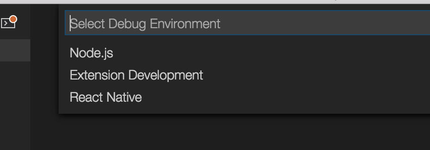
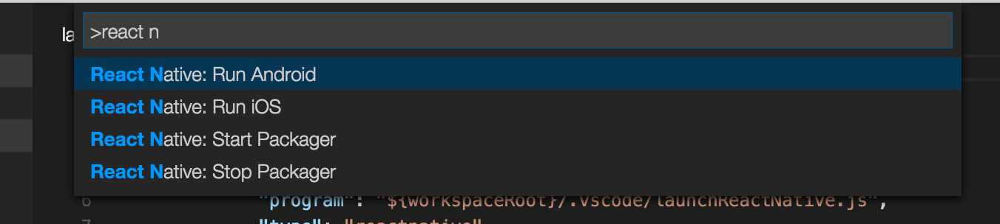
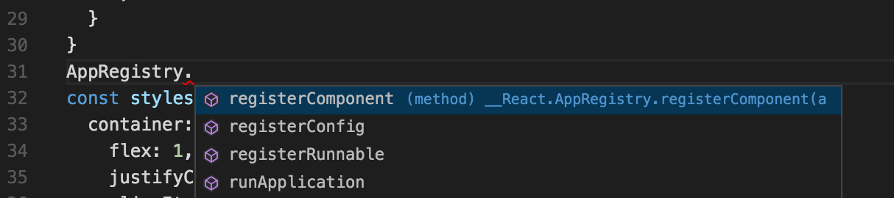

# React Native Tools

This extension provides a development environment for React Native projects.
Using this extension, you can debug your code, quickly run `react-native` commands from the command palette, and use IntelliSense to browse objects, functions and parameters for React Native APIs.

## Getting started

* [Install VS Code](https://code.visualstudio.com).
* [Install the extension](https://code.visualstudio.com/docs/editor/extension-gallery) in VS Code:
  1. Press `Ctrl + Shift + X` (`Cmd + Shift + X` on macOS), wait a moment while the list of available extensions is populated
  2. Type `react-native` and install **React Native Tools**
  3. For more guidance view [VS Code Extension Gallery](https://code.visualstudio.com/docs/editor/extension-gallery)
* If you haven't already, install React Native:
  1. Run `npm install -g react-native-cli` to install React Native CLI
  2. Set up React Native using the steps detailed on the React Native [getting started documentation ](https://facebook.github.io/react-native/docs/getting-started.html)
* Open your React Native project root folder in VS Code.

Please notice that the extension uses `.vscode/.react` directory at the project root to store intermediate files required for debugging. Although these files usually get removed after debug session ends, you may want to add this directory to your project's `.gitignore` file.

## Debugging React Native applications

Click the debug icon  in the View bar, and then click the configuration (gear) icon , then choose the React Native debug environment.

VS Code will generate a `launch.json` in your project with some default configuration settings as shown below. You can safely close this file, choose the appropriate configuration in the Configuration dropdown, and then press F5 (or click _Green Arrow_  button) to start debugging your app in VS Code.

You can debug your app on an Android emulator, Android device or iOS simulator. This extension provides [experimental support](doc/debugging.md#debugging-on-ios-device) for iOS devices.

More information about debugging using VS Code can be found in this [guide](https://code.visualstudio.com/docs/editor/debugging).

See [Setting up debug environment](doc/debugging.md) for more details.

## Using React Native commands in the Command Palette

In the Command Palette, type `React Native` and choose a command.

The **Run Android** command triggers `react-native run-android` and starts your app for Android.

The **Run iOS** command similarly triggers `react-native run-ios` and starts your app in the iOS simulator (iPhone 6).

The **Packager** commands allow you to start/stop the [**Metro Bundler**](https://github.com/facebook/metro-bundler) (formerly React Packager).

## Using IntelliSense

IntelliSense helps you discover objects, functions, and parameters in React Native.

IntelliSense is enabled automatically once you open the project in VS Code, so no additional action is required. Notice that in order to set it up, the extension might create a `jsconfig.json` file (if no such file exists) in the project root with `allowJs: true` to allow TypeScript to process JavaScript files.

See also [Setting up Flowtype for IntelliSense](doc/intellisense.md) for more advanced setup.

## Using Expo

We support using exponentjs to run, debug and publish applications. For more information on exponent, see [here](https://docs.getexponent.com/).

For more details about configuring and debugging Expo applications see [Expo docs](doc/expo.md)

## Build APK and Generate Bundle

You can add VSCode tasks to build an .apk file and generate iOS/Android bundles. See [here](doc/tasks.md) for more info.

## Contributing

Please see our [contributing guide](CONTRIBUTING.md) for more information

## Known Issues

Here is the list of common known issues you may experience while using the extension:

Issue                                | Description
------------------------------------ | -------------------------------------------------------------------------------------------------------------------------------------------
Debugger doesn't stop at breakpoints | Breakpoints require sourcemaps to be correctly configured. If you are using TypeScript, then make sure to follow the `Getting started` section for how to ensure sourcemaps are correctly set up.
'adb: command not found'             | If you receive an error `adb: command not found`, you need to update your system Path to include the location of your *ADB* executable.The *ADB* executable file is located in a subdirectory along with your other Android SDK files.
Targeting iPhone 6 doesn't work      | There was a known issue with React Native ([#5850](https://github.com/facebook/react-native/issues/5850)) but it was fixed. Please upgrade your version of React Native.
Can't comunicate with socket pipe    | (Linux only) If you have two workspaces open that only differ in casing, the extension will fail to comunicate effectively.

[Known-Issues](https://github.com/Microsoft/vscode-react-native/issues?q=is%3Aissue+label%3Aknown-issues) provides a complete list of active and resolved issues.

## Telemetry reporting
VS Code React Native extension collects usage data and sends it to Microsoft to help improve our products and services. Read our [privacy statement](https://www.visualstudio.com/en-us/dn948229) to learn more.

If you don’t wish to send usage data to Microsoft, edit `VSCodeTelemetrySettings.json` file at `~/.vscode-react-native` and add `optIn:false`.

## Code of conduct
This project has adopted the [Microsoft Open Source Code of Conduct](https://opensource.microsoft.com/codeofconduct/). For more information see the [Code of Conduct FAQ](https://opensource.microsoft.com/codeofconduct/faq/) or contact [opencode@microsoft.com](mailto:opencode@microsoft.com) with any additional questions or comments.
