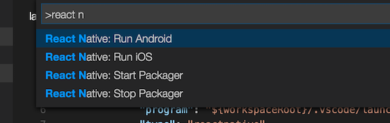
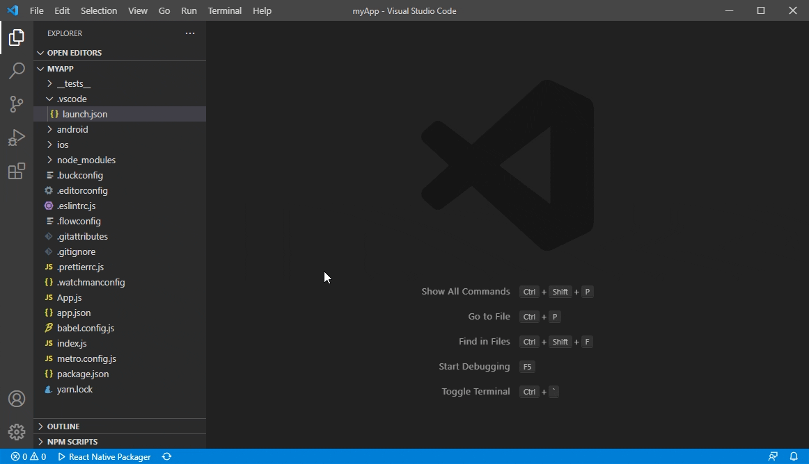
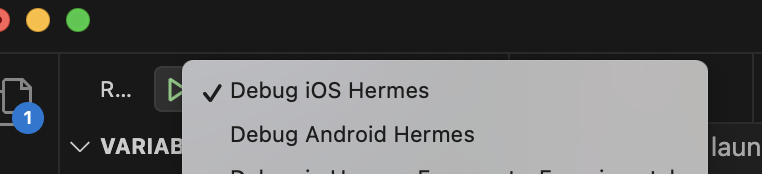

# React Native Tools

[](https://dev.azure.com/vscode-webdiag-extensions/VS%20Code%20WebDiag%20extensions/_build/latest?definitionId=60&branchName=master)

Stable:


Preview:


## React Native Tools Preview

The extension has a [nightly version](https://marketplace.visualstudio.com/items?itemName=msjsdiag.vscode-react-native-preview) which is released on a daily basis at 9 PM PST on each day that changes occur.
To avoid conflicts, if both extensions are installed - only stable version will be activated. So to use the preview version it is needed to disable or remove the stable version and reload VS Code.

## About the extension

This VS Code extension provides a development environment for React Native projects.
Using this extension, you can **debug your code and quickly run `react-native` commands** from the command palette.


<!-- TABLE OF CONTENTS -->

# Table of Contents

- [React Native Tools Preview](#react-native-tools-preview)
- [About the extension](#about-the-extension)
- [Getting started](#getting-started)
- [React Native commands in the Command Palette](#react-native-commands-in-the-command-palette)
- [Customize metro configuration](#customize-metro-configuration)
- [Debugging React Native applications](#debugging-react-native-applications)
  - [Hermes engine and direct debugging (Recommended)](#hermes-engine-and-direct-debugging-recommended)
  - [Attach to Hermes application](#attach-to-hermes-application)
  - [Android applications](#android-applications)
    - [Android Hermes Debugging](#android-hermes-debugging)
    - [Custom build for android apps](#custom-build-for-android-apps)
  - [iOS applications](#ios-applications)
    - [iOS Hermes debugging](#ios-hermes-debugging)
    - [iOS devices](#ios-devices)
    - [Custom scheme for iOS apps](#custom-scheme-for-ios-apps)
    - [iOS direct debugging](#iOS-direct-debugging)
  - [Expo applications](#expo-applications)
    - [Debug on Expo Go](#debug-on-expo-go)
    - [Debug on expo-dev-client](#debug-on-expo-dev-client)
    - [Debug on Expo Web](#debug-on-expo-web)
    - [Configuring Expo](#configuring-expo)
    - [Expo Hermes](#expo-hermes)
  - [Windows applications](#react-native-for-windows)
    - [Windows Hermes debugging](#windows-hermes-debugging)
  - [MacOS applications](#react-native-for-macos)
    - [MacOS Hermes debugging](#macos-hermes-debugging)
  - [Debug out of React Native project directory](#debug-out-of-react-native-project-directory)
  - [TypeScript and Haul based applications](#typescript-and-haul)
  - [Debugger configuration properties](#debugger-configuration-properties)
  - [Remote JavaScript Debugging (Deprecated)](#remote-javascript-debugging-deprecated)
- [Customization](#customization)
  - [Debug in vscode workspace](#debug-in-vscode-workspace)
  - [Logging](#logging)
  - [Build APK and generate bundle](#build-apk-and-generate-bundle)
  - [Specifying custom arguments for `react-native run-*` command](#specifying-custom-arguments-for-react-native-run--command)
  - [Setting up the React Native packager](#setting-up-the-react-native-packager)
  - [Change project root](#change-project-root)
  - [Configure an Android LogCat Monitor](#configure-an-android-logcat-monitor)
  - [Configure dependencies versions for debugging Expo projects](#configure-dependencies-versions-for-debugging-expo-projects)
  - [Configure custom key bindings for extension commands](#configure-custom-key-bindings-for-extension-commands)
  - [Configure custom colors for extension output logs](#configure-custom-colors-for-extension-output-logs)
- [Element inspector (Deprecated)](#element-inspector-deprecated)
- [Network Inspector](#network-inspector)
- [Developing inside a Docker Container](#developing-inside-a-docker-container)
- [Contributing](#contributing)
- [Known Issues](#known-issues)

# Getting started

Before going any further make sure that you:

- [have a working React Native environment](https://reactnative.dev/docs/environment-setup).
- have the [`emulator`](https://developer.android.com/studio/run/emulator-commandline) utility available in your `PATH` if you're developing Android applications
- are using [VS Code](https://code.visualstudio.com) and have [installed this extension from the Marketplace](https://marketplace.visualstudio.com/items?itemName=msjsdiag.vscode-react-native).
- have your React Native project root folder open in VS Code.
- have launched "React Native: Check development environment configuration" command in order to make sure that all necessary software is installed and recognized correctly.

Please notice that the extension uses `.vscode/.react` directory at the project root to store intermediate files required for debugging. Although these files usually get removed after debug session ends, you may want to add this directory to your project's `.gitignore` file.

# React Native commands in the Command Palette

In the Command Palette, type `React Native` and choose a command.



The **Run Android** command triggers `react-native run-android` and starts your app for Android.

The **Run iOS** command similarly triggers `react-native run-ios` and starts your app in the iOS simulator (e.g. iPhone 6).

The **Packager** commands allow you to start/stop the [**Metro Bundler**](https://github.com/facebook/metro-bundler) (formerly React Packager).

The full list of commands is:

| Name                                          | Command ID                            | Description                                                                                                                                                                                                                                |
| --------------------------------------------- | ------------------------------------- | ------------------------------------------------------------------------------------------------------------------------------------------------------------------------------------------------------------------------------------------ |
| Launch Android Emulator                       | `reactNative.launchAndroidSimulator`  | Prompts you to select the name of the available Android emulator and launch it. If only one emulator is installed in the system, it will be selected automatically                                                                         |
| Launch iOS Simulator                          | `reactNative.launchIOSSimulator`      | Prompts you to select the available system version of the iOS simulator, then select the simulator name for the selected system and launch it. If only one simulator is installed in the system, it will be selected automatically         |
| Launch ExpoWeb                                | `reactNative.launchExpoWeb`           | Check if the current project is an Expo project. If so, lanuch ExpoWeb.                                                                                                                                                                    |
| Run Android on Emulator                       | `reactNative.runAndroidSimulator`     | Run an Android application on Emulator. Launch order: check target platform support, load run arguments, start Packager, run app on the selected emulator. Make sure the `emulator` utility is added to `PATH`                             |
| Run Android on Device                         | `reactNative.runAndroidDevice`        | Run an Android application on Device. Launch order: check target platform support, load run arguments, start Packager, run app in all connected devices                                                                                    |
| Run iOS on Simulator                          | `reactNative.runIosSimulator`         | Run an iOS application on Simulator. Launch order: load run arguments, check target platform support, start Packager, run app in only one connected emulator                                                                               |
| Run iOS on Device                             | `reactNative.runIosDevice`            | Run an iOS application on Device. Launch order: load run arguments, check target platform support, start Packager, run app in only one connected device                                                                                    |
| Run Expo                                      | `reactNative.runExponent`             | Run an Exponent application. Launch order: login to exponent, load run arguments, start Packager, run app                                                                                                                                  |
| Run Windows                                   | `reactNative.runWindows`              | Run a RNW application. Launch order: check target platform support, load run arguments, start Packager, run app                                                                                                                            |
| Run MacOS                                     | `reactNative.runMacOS`                | Run a RNmacOS application. Launch order: check target platform support, load run arguments, start Packager, run app                                                                                                                        |
| Start Packager                                | `reactNative.startPackager`           | Start Packager in context project workspace folder                                                                                                                                                                                         |
| Stop Packager                                 | `reactNative.stopPackager`            | Stop Packager                                                                                                                                                                                                                              |
| Restart Packager                              | `reactNative.restartPackager`         | Restart Packager and clear the Packager's cache                                                                                                                                                                                            |
| Publish To Expo                               | `reactNative.publishToExpHost`        | Publish to Exponent Host. Launch order: login to exponent, execute `Run Expo` command, then publish app to host                                                                                                                            |
| Show Dev Menu                                 | `reactNative.showDevMenu`             | Show development menu for running aplication on iOS or Android device or emulator                                                                                                                                                          |
| ReloadApp                                     | `reactNative.reloadApp`               | Reload an application                                                                                                                                                                                                                      |
| Run Element Inspector                         | `reactNative.runInspector`            | Load development tools for inspect application UI elements                                                                                                                                                                                 |
| Stop Element Inspector                        | `reactNative.stopInspector`           | Stop development tools for inspect application UI elements                                                                                                                                                                                 |
| Run React Native LogCat Monitor               | `reactNative.startLogCatMonitor`      | Creates a LogCat Monitor for the chosen online Android device to see the device LogCat logs. Default filtering arguments: ["*:S", "ReactNative:V", "ReactNativeJS:V"]. [How to configure filtering.](#configure-an-Android-LogCat-Monitor) |
| Stop React Native LogCat Monitor              | `reactNative.stopLogCatMonitor`       | Stops an existing LogCat Monitor and removes its output channel                                                                                                                                                                            |
| Run Network Inspector                         | `reactNative.startNetworkInspector`   | Run [Network inspector](#network-inspector)                                                                                                                                                                                                |
| Stop Network Inspector                        | `reactNative.stopNetworkInspector`    | Stop [Network inspector](#network-inspector)                                                                                                                                                                                               |
| Check development environment configuration   | `reactNative.testDevEnvironment`      | Checks your development environment for common problems                                                                                                                                                                                    |
| Open the eas project in a web page            | `reactNative.openEASProjectInWebPage` | Open EAS build in your EAS project portal                                                                                                                                                                                                  |
| Open react native upgrade helper in web page  | `reactNative.openRNUpgradeHelper`     | Open an official project upgrade tools in browser, support RN, RN for Windows, RN for MacOS                                                                                                                                                |
| Revert extension input in open package module | `reactNative.revertOpenModule`        | Quickly revert some codes in Open Module which are changed by react-native-tools                                                                                                                                                           |
| Run doctor                                    | `reactNative.docter`                  | Execute react-native doctor to check basic environemt for react-native development                                                                                                                                                         |
| Run expo doctor                               | `reactNative.ExpoDocter`              | Execute expo docter to check basic environemt for Expo development                                                                                                                                                                         |
| Expo prebuild                                 | `reactNative.expoPrebuild`            | Create the android and ios directories for running your React code                                                                                                                                                                         |
| Expo prebuild cleanup                         | `reactNative.expoPrebuildClean`       | Clean directories generated by prebuild                                                                                                                                                                                                    |
| Reopen QR Code in Expo                        | `reactNative.reopenQRCode`            | Reopen expo generated QR code in webview                                                                                                                                                                                                   |

## Using commands in VS Code tasks

To run React Native Tools commands via VS Code tasks, you can create a `.vscode/tasks.json` file in your project and add tasks configurations the following way:

```json
{
  "version": "2.0.0",
  "tasks": [
    {
      "label": "Run Android on Emulator",
      "command": "${command:reactNative.runAndroidSimulator}",
      "problemMatcher": []
    }
  ]
}
```

# Customize metro configuration

Metro is a JavaScript bundler for React Native and include in React Native package. Metro configuration can be customized in `metro.config.js`.

Note: From React Native 0.72.0, the config loading setup for Metro in React Native CLI(`@react-native/metro-config`).

# Debugging React Native applications

To start debugging create a new debug configuration for your ReactNative app in your `.vscode/launch.json`. Adding a new configuration can be done by opening your `launch.json` file and clicking on `Add Configuration...` button and then selecting `React Native` option. After that the extension will prompt you to create a debugging configuration by selecting debugging parameters in dropdown lists at the top of the editor. A new debugging configuration will be generated and added to the `launch.json` file automatically as shown in the image below.



In case you haven't created the `.vscode/launch.json` file yet, you can add a whole default debug configuration set. To do that click `create a launch.json file` in the View bar, then choose the React Native debug environment.


VS Code will generate a `launch.json` in your project with some default configuration settings as shown below. You can safely close this file, choose the appropriate configuration in the Configuration dropdown, and then press F5 (or click _Green Arrow_  button) to start debugging your app in VS Code.



The extension also allows to start debugging without creating the `launch.json` file in one of the following ways:

- Using dynamic debugging configurations

  To use dynamic debugging configurations you can click on the `Show all automatic debug configurations` string in the `Run and Debug` panel, then select `React Native` in the list of extensions and choose the appropriate configuration in the Configuration list to start debugging.

  

- Using `Debug` button in the Editor Title area menu

  To start debugging you can click the Debug button in the Editor Title area in the upper right corner. You can also select the appropriate debugging scenario by clicking the dropdown button beside the Debug button and choosing the scenario.

  

The extension allows you to debug multiple devices and configurations, please read the following sections for more information for your particular use case.

## Hermes engine and direct debugging (Recommended)

React-native set Hermes as default engine from 0.70. Please see [official documentation](https://reactnative.dev/blog/2022/07/08/hermes-as-the-default) to get details.

The Hermes engine is an open source JavaScript engine created by Facebook to optimize building and running React Native applications. It improves app performance and decreases app size.

Click [here](https://reactnative.dev/docs/hermes) to learn more about Hermes and how to enable it for your application.
To turn off Hermes, you can do the same changes in documentation but set `Hermes Flag` to `False`.

## Attach to Hermes application

To attach to a running Hermes application use `Attach to Hermes application` launch configuration:

```json
{
  "name": "Attach to Hermes application",
  "cwd": "${workspaceFolder}",
  "type": "reactnativedirect",
  "request": "attach"
}
```

## Android applications

### Android Hermes debugging

To debug while using Hermes engine use `Debug Android Hermes` launch configuration:

```json
{
  "name": "Debug Android Hermes",
  "cwd": "${workspaceFolder}",
  "type": "reactnativedirect",
  "request": "launch",
  "platform": "android"
}
```

### Custom build for Android apps

If you want to use a custom `applicationIdSuffix` for your application to launch specific build, you can either pass it as part of the `runArguments` parameter arguments as shown below:

```js
"runArguments": ["--appIdSuffix", "customAppIdSuffix", ...]
// or
"runArguments": ["--appIdSuffix=customAppIdSuffix", ...]
```

## iOS applications

### iOS Hermes debugging

To debug your iOS Hermes application, you can use `Debug iOS Hermes` launch configuration to debug an iOS Hermes application:

```json
{
  "name": "Debug iOS Hermes",
  "cwd": "${workspaceFolder}",
  "type": "reactnativedirect",
  "request": "launch",
  "platform": "ios"
}
```

### iOS devices

Debugging on an iOS device requires following manual steps:

- Install [ios-deploy](https://github.com/ios-control/ios-deploy) `brew install ios-deploy`.
- Install a valid iOS development certificate.
- In your project's `launch.json` file set `target` to `device`. If you need to specify the exact device to run, you can set `target` to `<iOS device name/udid>`, or you can also use `runArguments` property to specify a particular device to run on in case multiple devices are connected (e.g. `"runArguments": [ "--device", "My iPhone" ]`)
- Choose the **Debug iOS** option from the "Configuration" dropdown and press F5.
- Shake the device to open the development menu and select "Debug JS Remotely".

### Custom scheme for iOS apps

If you want to use a custom scheme for your application you can either pass it as part of the `runArguments` parameter arguments as shown below:

```js
"runArguments": ["--scheme", "customScheme", ...]
// or
"runArguments": ["--scheme=customScheme", ...]
```

Please be aware, specifying the scheme value as a part of the `runArguments` parameter arguments will override the `scheme` configuration parameter value, if it set.

### iOS direct debugging

The extension provides experimental support of iOS direct debugging. See more info here: [react-native-community/discussions-and-proposals#40](https://github.com/react-native-community/discussions-and-proposals/issues/40), [react-native-community/discussions-and-proposals#206](https://github.com/react-native-community/discussions-and-proposals/issues/206)

For now the extension supports iOS direct debugging only on real iOS devices.

To be able to debug an iOS app directly, you need to install [ios-webkit-debug-proxy](https://github.com/google/ios-webkit-debug-proxy):

- Install [HomeBrew](https://brew.sh) on your Mac.
- Open a Terminal and run `brew install ideviceinstaller ios-webkit-debug-proxy`

You can use the following debug scenarios to debug iOS apps directly:

- React Native Direct: Debug Direct iOS - Experimental

```json
    "name": "Debug Direct iOS - Experimental",
    "cwd": "${workspaceFolder}",
    "type": "reactnativedirect",
    "request": "launch",
    "platform": "ios",
    "port": 9221,
    "target": "device"
```

- React Native Direct: Attach to the React Native iOS - Experimental

```json
    "name": "Attach to the React Native iOS - Experimental",
    "cwd": "${workspaceFolder}",
    "type": "reactnativedirect",
    "request": "attach",
    "platform": "ios",
    "port": 9221
```

## Expo applications

To debug a project created using Expo or the `create-react-native-app` task, you can use embedded support for Expo.

Prepare your environment by following the [Expo CLI Quickstart instruction](https://reactnative.dev/docs/environment-setup).
For correct work with Expo this extension **`requires Android SDK`**.
So also pay attention to the `React Native CLI Quickstart` tab, where you can find the Android SDK installation guide:

- Install the [Expo app](https://getexponent.com/) on the target device or emulator
- Ensure that the `Android SDK` is installed on your computer (You may install it using the [`React Native CLI Quickstart` guide](https://reactnative.dev/docs/environment-setup))
- Ensure that the `expo-cli` is installed globally (`npm install -g expo-cli`)

You can verify that everything is working correctly and that the environment is ready for use with the `npx react-native doctor` command.

### Debug on Expo Go

If you're using [Expo Go](https://expo.dev/expo-go), follow below steps tp start debugging Expo application:

1. Open your project in VS Code with this extension installed.
1. Create a debug configuration (as described in [Debugging React Native applications](#debugging-react-native-applications)), select `Debug in Exponent` in the debug drop-down menu, and start debugging
1. Wait while some dependencies are configured - the extension will install [`Expo Development Library(xdl)`](https://www.npmjs.com/package/xdl) when this feature is used for the first time.
1. If you have not used Exponent on this system before, you will be prompted for an Exponent username and password.
   Exponent account allows you to use Expo cloud services. More info about how it works is available [here](https://docs.expo.io/versions/latest/workflow/how-expo-works/).
   If you have not created an Exponent account, then specifying a new username and password will create one.
   Note that there is no e-mail associated with the account, and no way to recover a forgotten password.
   If you don't want to create an Exponent account, you can specify `expoHostType` parameter in your debug configuration to make Expo work locally (via LAN or on localhost).
1. Once the packager starts, the extension will open a separate tab with QR code to scan from the Expo Go. Once you do so, the Expo Go will connect to the packager and begin running your app.

### Debug on expo-dev-client

If you want to debug Expo app using [expo-dev-client](https://docs.expo.dev/development/getting-started/), follow below steps to start debugging Expo application:

1. Open your project in VS Code with this extension installed.
2. In project folder, install expo-dev-client for your app using `npx expo install expo-dev-client`
3. Create your app in development mode `eas build --profile development --platform all`, replace `--platform all` to `android` or `iOS` to build specific platform application(need development account for `iOS` platform).
4. After build success, download your build and install application to your device or simulator
5. In project, using `npx expo start --dev-client` to start Metro and load application in device or simulator
6. Using `CMD + D` or `Ctrl + M` to open dev menu, then enable local devtools
7. If your Chrome or MS Edge open devtools after enabling local devtools, waiting the status is changed to `Status: Debugger session active`, then close browser devtools.
8. Add `Attach to application` command `./.vscode/launch.json`

```json
    "configurations": [
        {
            "name": "Attach to Hermes application",
            "request": "attach",
            "type": "reactnativedirect",
            "cwd": "${workspaceFolder}"
        }
    ]
```

9. Run `Attach` command in debug tab and debugger will start to work(If debugger not go into breakpoint, you need to reload app from Metro to refresh app since maybe it had some conflicts between Browser devtools debug session and RNT debug session).

### Debug on Expo Web

Expo support open application in browser, the expo web application is generated by [react-native-web](https://necolas.github.io/react-native-web/). It can help user open application without any Android emulator, iOS simulator or device. React-native-tools supports debugging Expo Web application in Chrome and Edge. Follow below steps to start Expo Web debugging:

1. Open your project in VS Code with this extension installed.
2. Check and install related package: `react-dom`, `react-native-web` and `@expo/webpack-config` (this package is deprecated from Expo 49) by `npx expo install` command.
3. Add Expo Web debugging configure in `launch.json`:

```json
    "configurations": [
       {
            "name": "Debug Expo Web - Experimental",
            "request": "launch",
            "type": "reactnativedirect",
            "cwd": "${workspaceFolder}",
            "platform": "expoweb",
            "browserTarget": "chrome",
            "url": "http://localhost:8081"
        }
    ]
```

4. Execute and start debugging

### Configuring Expo

The extension supports running through Exponent not just the applications created with Expo but even pure React Native applications (in that case you need to add `expo` package to `node_modules` in order to make it work with Expo: `npm install expo --save-dev`. In either cases it uses `app.json` configuration file in the root of the project.)

If you are running `Debug in Exponent` configuration or any of pallette commands like `Run in Exponent`, `Publish to Exponent` then this file will be created automatically if absent or updated with the following basic configuration section:

```json
{
  "expo": {
    "slug": "MyApp", // Project slug
    "name": "MyApp", // Project name
    "sdkVersion": "31.0.0", // Expo SDK version
    "entryPoint": ".vscode\\exponentIndex.js" // Entrypoint for the project
  },
  "name": "MyApp" // Project name
}
```

Full list of configuration parameters for `expo` section in `app.json` may be found on [official Expo documentation page](https://docs.expo.io/versions/latest/workflow/configuration).

For running **pure React Native app**, the extension, creates and uses `.vscode/exponentIndex.js` which points to the app entrypoint (`index.js` or `index.android.js` or `index.ios.js`) file.

If you want to change your app entrypoint (for example, from `index.js` to `index.android.js`), delete `.vscode/exponentIndex.js` and then restart your debugging session.

**NOTE**: The extension caches the version of the exponent SDK used by your project. This is helpful since we don't want to install the SDK each time you run exponent. If you want the extension to update the SDK version based on your React Native version, just restart VS Code and if it is supported it should work. If it does not please open an issue.

### Expo Hermes

Expo app is supporting Hermes Engine, and please note that Hermes engine is the default Javascript engine used by Expo since SDK 48. SDK 47 and lower version will no longer be supported in the next release. (Please refer to https://docs.expo.dev/guides/using-hermes/) We suggest everyone to upgrade your Expo projects to use Expo 48 or newer SDKs.

You can add or remove `"jsEngine": "hermes"` in `app.json` to enable or disable Hermes Engine. And any changes for app engine you need to run `eas build` to rebuild your application.

```json
{
  "expo": {
    "jsEngine": "hermes"
  }
}
```

**Note**: You maybe need to create developer account to run `eas build`. Any other issue or limitiation, please see [expo hermes ducomentation](https://docs.expo.dev/guides/using-hermes/).

## React Native for Windows

### Windows Hermes debugging

Before launching and debugging a React Native for Windows application, please make sure that your development environment is configured properly in accordance with [the official system requirements](https://microsoft.github.io/react-native-windows/docs/rnw-dependencies).

Please follow [the official guide](https://microsoft.github.io/react-native-windows/docs/hermes#hermes-on-windows) to enable Hermes engine for a Windows application.

You can debug UWP React Native for Windows applications by changing the `platform` in your `launch.json` configuration to `windows`:

```json
{
  "name": "Debug Windows",
  "cwd": "${workspaceFolder}",
  "type": "reactnativedirect",
  "request": "launch",
  "platform": "windows"
}
```

Also you can attach running application using `Attach to Hermes application` configuration to `.vscode/launch.json` in your project.

## React Native for MacOS

### MacOS Hermes debugging

Please follow [the official guide](https://microsoft.github.io/react-native-windows/docs/hermes#available-on-macos) to enable Hermes engine for a macOS application.

To debug a macOS Hermes application you can use `Debug macOS Hermes` debugging scenario:

```json
{
  "name": "Debug macOS Hermes",
  "request": "launch",
  "type": "reactnativedirect",
  "cwd": "${workspaceFolder}",
  "platform": "macos"
}
```

Also you can attach running application using `Attach to Hermes application` configuration to `.vscode/launch.json` in your project.

## Debug out of React Native project directory

If your project structure like this:

```
common
- utils.ts
app
- src/
- metro.config.js
```

When you import `utils.ts` in your project. Using

```js
import { commonFunction } from "../../common/utils";
```

Will get error when start Metro:

```
error: bundling failed: Error: Unable to resolve module `../../common/utils` from `src/App.js`
```

To import files in `metro.config.js`, user can debug code out of react native project.

1. Add extra module and watch folder for the file parent folder.

```js
const extraNodeModules = {
  common: path.resolve(__dirname + "/../common"),
};
const watchFolders = [path.resolve(__dirname + "/../common")];
```

2. Add module and watch folder in metro config.

```js
// React native <= 0.72.0
module.exports = {
  resolver: {
    extraNodeModules,
  },
  watchFolders,
};

// React native >= 0.72.0
const config = {
  resolver: {
    extraNodeModules,
  },
  watchFolders,
};
```

3. After mapping common key to common/ path, we can include any files inside common/ relative to this path. Metro is started, launching or debugging is working well.

```js
import { commonFunction } from "common/utils";
```

## TypeScript and Haul

### Sourcemaps

The debugger uses sourcemaps to let you debug with your original sources, but sometimes the sourcemaps aren't generated properly and overrides are needed. In the config we support `sourceMapPathOverrides`, a mapping of source paths from the sourcemap, to the locations of these sources on disk. Useful when the sourcemap isn't accurate or can't be fixed in the build process.

The left hand side of the mapping is a pattern that can contain a wildcard, and will be tested against the `sourceRoot` + `sources` entry in the source map. If it matches, the source file will be resolved to the path on the right hand side, which should be an absolute path to the source file on disk.

Below there are some examples of how sourcemaps could be resolved in different scenarios:

```javascript
// webRoot = /Users/me/project
"sourceMapPathOverrides": {
    "webpack:///./~/*": "${webRoot}/node_modules/*",       // Example: "webpack:///./~/querystring/index.js" -> "/Users/me/project/node_modules/querystring/index.js"
    "webpack:///./*":   "${webRoot}/*",                    // Example: "webpack:///./src/app.js" -> "/Users/me/project/src/app.js",
    "webpack:///*":     "*",                               // Example: "webpack:///project/app.ts" -> "/project/app.ts"
    "webpack:///src/*": "${webRoot}/*"                     // Example: "webpack:///src/app.js" -> "/Users/me/project/app.js"
}
```

### Haul debugging

The extension provides functional to attach to [Haul packager](https://callstack.github.io/haul/) based applications. You can use the `Attach to packager` scenario to attach to a Haul based app and debug it. For now launch scenarios aren't supported. You can find more info in [the issue](https://github.com/microsoft/vscode-react-native/issues/883).

You can prepare your React Native application to work with `Haul` by following the [`Haul Getting started` guide](https://github.com/callstack/haul#getting-started).

If you use the [legacy version](https://github.com/callstack/haul/tree/legacy) of `Haul` as your React Native bundler instead of the default [Metro](https://facebook.github.io/metro/), it could be required to add `sourceMapPathOverrides` to the `launch.json` file.

For example:

```json
{
  // Other configurations
  "sourceMapPathOverrides": {
    "webpack:///./~/*": "${workspaceRoot}/node_modules/*",
    "webpack:///./*": "${workspaceRoot}/*",
    "webpack:///*": "*"
  }
}
```

## Debugger configuration properties

The following is a list of all the configuration properties the debugger accepts in `launch.json`:

| Name                               | Description                                                                                                                                                                                                                                                                                                                                                                                                                                                                                                                                                                                                                                                                                                                                                            | Type       | Defaults                                      |
| ---------------------------------- | ---------------------------------------------------------------------------------------------------------------------------------------------------------------------------------------------------------------------------------------------------------------------------------------------------------------------------------------------------------------------------------------------------------------------------------------------------------------------------------------------------------------------------------------------------------------------------------------------------------------------------------------------------------------------------------------------------------------------------------------------------------------------- | ---------- | --------------------------------------------- |
| `cwd`                              | The path to the project root folder                                                                                                                                                                                                                                                                                                                                                                                                                                                                                                                                                                                                                                                                                                                                    | `string`   | `${workspaceFolder}`                          |
| `sourceMaps`                       | Whether to use JavaScript source maps to map the generated bundled code back to its original sources                                                                                                                                                                                                                                                                                                                                                                                                                                                                                                                                                                                                                                                                   | `boolean`  | `true`                                        |
| `sourceMapPathOverrides`           | A set of mappings for rewriting the locations of source files from what the source map says, to their locations on disk. See [Sourcemaps](#sourcemaps) for details                                                                                                                                                                                                                                                                                                                                                                                                                                                                                                                                                                                                     | `object`   | n/a                                           |
| `sourceMapRenames`                 | Whether to use the "names" mapping in sourcemaps. This requires requesting source content, which could slow debugging                                                                                                                                                                                                                                                                                                                                                                                                                                                                                                                                                                                                                                                  | `boolean`  | `false`                                       |
| `enableDebug`                      | Whether to enable debug mode. If set to "false", an application will be launched without debugging                                                                                                                                                                                                                                                                                                                                                                                                                                                                                                                                                                                                                                                                     | `boolean`  | `true`                                        |
| `webkitRangeMin`, `webkitRangeMax` | Combines to specify the port range that you want the [ios-webkit-debug-proxy](https://github.com/google/ios-webkit-debug-proxy) to use to find the specific device described in the Direct iOS debug configuration                                                                                                                                                                                                                                                                                                                                                                                                                                                                                                                                                     | 9223, 9322 |
| `trace`                            | Logging level in debugger process. May be useful for diagnostics. If set to "Trace" all debugger process logs will be available in `Debug Console` output window                                                                                                                                                                                                                                                                                                                                                                                                                                                                                                                                                                                                       | `string`   | `log`                                         |
| `address`                          | TCP/IP address of packager to attach to for debugging                                                                                                                                                                                                                                                                                                                                                                                                                                                                                                                                                                                                                                                                                                                  | `string`   | `localhost`                                   |
| `port`                             | Port of packager to attach to for debugging                                                                                                                                                                                                                                                                                                                                                                                                                                                                                                                                                                                                                                                                                                                            | `string`   | `8081`                                        |
| `remoteRoot`                       | The source root of the remote host                                                                                                                                                                                                                                                                                                                                                                                                                                                                                                                                                                                                                                                                                                                                     | `string`   | `null`                                        |
| `localRoot`                        | The local source root that corresponds to the 'remoteRoot'                                                                                                                                                                                                                                                                                                                                                                                                                                                                                                                                                                                                                                                                                                             | `string`   | `${workspaceFolder}`                          |
| `skipFiles`                        | An array of file or folder names, or glob patterns, to skip when debugging                                                                                                                                                                                                                                                                                                                                                                                                                                                                                                                                                                                                                                                                                             | `array`    | `[]`                                          |
| `debuggerWorkerUrlPath`            | Path to the app debugger worker to override. For example, if debugger tries to attach to http://localhost:8081/debugger-ui/debuggerWorker.js and you get 404 error from packager output then you may want to change debuggerWorkerUrlPath to another value suitable for your packager (\"debugger-ui\" will be replaced with the value you provide)                                                                                                                                                                                                                                                                                                                                                                                                                    | `string`   | `debugger-ui/`                                |
| `platform`                         | The platform to target. Possible values: `android`, `ios`, `exponent`, `windows`                                                                                                                                                                                                                                                                                                                                                                                                                                                                                                                                                                                                                                                                                       | `string`   | n/a                                           |
| `target`                           | Target to run on. Possible values: `simulator`, `device`, `<iOS target name/udid>`, [`<Android target id>`](https://github.com/react-native-community/cli/blob/master/docs/commands.md#--deviceid-string), `<Android emulator AVD name>`. If the value is `simulator` or `device` then the quick pick window will be expanded with the names of the available virtual or physical targets, then, in case there are more than one available target with specified type, the target value in `launch.json` will be changed to the name or id of the selected target. If you have only one target with specified type available, it will be selected automatically. If you're using Android emulator targets, please, make sure the `emulator` utility is added to `PATH` | `string`   | `simulator`                                   |
| `logCatArguments`                  | Arguments to be used for LogCat (The LogCat output will appear on an Output Channel). It can be an array such as: `[":S", "ReactNative:V", "ReactNativeJS:V"]`                                                                                                                                                                                                                                                                                                                                                                                                                                                                                                                                                                                                         | `array`    | `["*:S", "ReactNative:V", "ReactNativeJS:V"]` |
| `runArguments`                     | Run arguments to be passed to `react-native run-<platform>` command (override all other configuration params)                                                                                                                                                                                                                                                                                                                                                                                                                                                                                                                                                                                                                                                          | `array`    | n/a                                           |
| `launchActivity`                   | The Android activity to be launched for debugging, e.g. it specifies [`--main-activity`](https://github.com/react-native-community/cli/blob/master/docs/commands.md#--main-activity-string) parameter in `react-native` run arguments                                                                                                                                                                                                                                                                                                                                                                                                                                                                                                                                  | `string`   | `MainActivity`                                |
| `expoHostType`                     | The connection type to be used on Expo debugging to communicate with a device or an emulator. Possible values: <ul><li>`tunnel` - allows to deploy and debug an application by means of Expo cloud services</li><li>`lan` - allows to deploy and install an application via your LAN</li><li>`local` - allows to debug an application on an emulator or an Android device without network connection</li></ul>                                                                                                                                                                                                                                                                                                                                                         | `string`   | `lan`                                         |
| `env`                              | Environment variables passed to the debugger and `react-native run-<platform>` command                                                                                                                                                                                                                                                                                                                                                                                                                                                                                                                                                                                                                                                                                 | `object`   | `{}`                                          |
| `envFile`                          | Absolute path to a file containing environment variable definitions                                                                                                                                                                                                                                                                                                                                                                                                                                                                                                                                                                                                                                                                                                    | `string`   | `${workspaceFolder}/.env`                     |
| `variant`                          | A variant to be passed to `react-native run-android`, e.g. use `devDebug` to specify `--variant=devDebug`                                                                                                                                                                                                                                                                                                                                                                                                                                                                                                                                                                                                                                                              | `string`   | n/a                                           |
| `scheme`                           | A scheme name to be passed to `react-native run-ios`, e.g. `devDebug` to specify `--scheme=devDebug`                                                                                                                                                                                                                                                                                                                                                                                                                                                                                                                                                                                                                                                                   | `string`   | n/a                                           |
| `productName`                      | iOS bundle display name e.g. `AwesomeProject` value means that the extension will search for `AwesomeProject.app` bundle                                                                                                                                                                                                                                                                                                                                                                                                                                                                                                                                                                                                                                               | `string`   | n/a                                           |
| `jsDebugTrace`                     | Enable trace collection for depended extension `vscode-js-debug`                                                                                                                                                                                                                                                                                                                                                                                                                                                                                                                                                                                                                                                                                                       | `boolean`  | n/a                                           |

## Remote JavaScript Debugging (Deprecated)

Remote JavScript debugging is deprecated by react-native team from [0.73](https://reactnative.dev/docs/0.75/other-debugging-methods#remote-javascript-debugging-deprecated) and may be removed officially at any time.

**We strongly recommend to use [Hermes engine and direct debugging](#hermes-engine-and-direct-debugging-recommended) in your application.**

Below config showed classic debug mode in extension, we may remove it from extension in the future if it's totally removed officially.

```
     {
            "name": "Debug Android",
            "request": "launch",
            "type": "reactnative",
            "cwd": "${workspaceFolder}",
            "platform": "android"
     }
```

# Customization

The extension can be further customized for other React Native scenarios. These are the most common:

## Debug in vscode workspace

Extension supports vscode multiple root workspace for development. If you have several react-native project in workspace, extension will show project selection list when react-native packager is starting. Also you can add settings in workspace to ignore specific project in selection list.

- Open vscode command palette, select `Preferences: Open Workspace Settings (JSON)` to open workspace settings file.
- Add below settings in the file:

```
	"settings": {
		"react-native.workspace.exclude": [
			"ProjectFolderName1",
			"ProjectFolderName2"
		]
	}
```

- Since the folder selection list is handled by vscode rather than extension, we must set exclude folder when extension is not activated. If you add exclude folder after extension activating, you must re-activate you extension or reopen your vscode.

## Logging

The extension logging is divided by several output channels:

- React Native - the main extension channel which collects outputs from React Native Packager and shows critical errors in the extension
- These channels are spawned only when the specific launch scenario is executed:
  - React Native: Run Android
    - LogCat monitor(to get LogCat output from Android device, can be filtered by debug configuration settings)
  - React Native: Run iOS
  - React Native: Run macOS
  - React Native: Run Windows
  - React Native: Run exponent
- Debug Console which is used to receive application logs and logs generated by the debug adapter (`console.log` and other `std` outputs from the app)
- Extension debugger verbose logs (these logs are shown up only if the `trace: "verbose"` option is enabled in debug scenarios)
  - React Native Chrome Proxy - shows what runs in and out to the debugger and application
  - Debug Console becomes more informative and contains some debugging information from the debug adapter
  - Global extension errors are controlled by VS Code and printed in VS Code Developer Tools

There are also some global extension technical logs that might be exposed to the output. To see them set the following properties in your VS Code Settings:

```json
{
  "react-native-tools": {
    "logLevel": "Trace"
  }
}
```

`logLevel` can be `None` (no logs), `Error`, `Warning`, `Info`, `Debug`, `Trace` (all logs). Default is `Info`.

## Build APK and generate bundle

You can add VSCode tasks to build an `.apk` file and generate iOS/Android bundles.

The following is an example of a `tasks.json` for `react-native init` projects.
Place it in the `.vscode` folder in your project to use it:

```json
{
  "version": "2.0.0",
  "presentation": {
    "reveal": "always",
    "panel": "new"
  },
  "tasks": [
    {
      "label": "Build APK Debug",
      "group": "build",
      "type": "shell",
      "windows": {
        "command": "cd android; if($?) {./gradlew assembleDebug}"
      },
      "linux": {
        "command": "cd android && ./gradlew assembleDebug"
      }
    },
    {
      "label": "Build APK Release",
      "group": "build",
      "type": "shell",
      "windows": {
        "command": "cd android; if($?) {./gradlew assembleRelease}"
      },
      "linux": {
        "command": "cd android && ./gradlew assembleRelease"
      }
    },
    {
      "label": "Generate Android Bundle",
      "group": "build",
      "type": "shell",
      "command": "npx react-native bundle --platform android --dev false --entry-file index.js --bundle-output android/main.jsbundle"
    },
    {
      "label": "Generate iOS Bundle",
      "group": "build",
      "type": "shell",
      "command": "npx react-native bundle --platform ios --dev false --entry-file index.js --bundle-output ios/main.jsbundle"
    }
  ]
}
```

To learn more about `tasks` in VSCode read [the official documentation](https://code.visualstudio.com/docs/editor/tasks).

Visit [generating Signed APK](https://reactnative.dev/docs/signed-apk-android) to learn more about this subject.

## Specifying custom arguments for `react-native run-*` command

Using custom run arguments for `react-native run-<platform>`:
**NOTE:** This overrides all other configuration parameters.

```json
{
  "react-native.android.runArguments.simulator": [
    "--appFolder",
    "/Users/test/AwesomeProject/android/app",
    "--deviceId",
    "emulator-5555"
  ],
  "react-native.ios.runArguments.device": [
    "--project-path",
    "ios",
    "--device",
    "Max's iPhone"
  ]
}
```

**NOTE:** You can get the list of installed simulator devices by:

iOS devices (macOS only):

```
xcrun simctl list --json devices
```

Android devices:

```
adb devices
```

**NOTE:** If you want to run the application on an iOS device, make sure you have `ios-deploy` installed globally.

`brew install ios-deploy`

## Setting up the React Native packager

To use a custom port for the `react-native` packager:

```json
{
  "react-native": {
    "packager": {
      "port": portNumber
    }
  }
}
```

If you change this port, then for iOS device and simulator scenarios you will have to modify the native code files. [Instructions here](https://childofcode.com/react-native-0-63-running-on-device-by-other-port-solution/).

If you use Android, you need to change the debug server by:

1. `CTRL+M`(`CMD+M`) in the emulator
2. Go to `Dev Settings`
3. Debug server host for device => enter `localhost:<yourPortNumber>`.
4. Reload application (press `R` twice)
5. (Hermes only) Hermes engine listens port 8081 for debugging by default, to change it you might need to modify your [`metro.config.js` file adding `"port": portNumber` argument in there to the server settings](https://facebook.github.io/metro/docs/configuration/#port).

```js
// Example of metro.config.js (<= 0.72.0)
module.exports = {
  server: {
    port: 9091,
  },
};
```

OR

```js
// Example of metro.config.js (0.72.0)
const config = {
  server: {
    port: 9091,
  },
};
```

<details>
<summary>Port setup instruction</summary>


</details>

**NOTE:** Some aspects of React Native hard-code the port to the default as specified in [this issue](https://github.com/facebook/react-native/issues/9145).

### Custom environment variables

Extension supports passing custom environment variables to the React Native Packager process context. To add custom variables you can create `.env` file in the root folder of your project and add needed environment variables in the following format:

```

Variable1_name=Variable1_value
Variable2_name=Variable2_value

```

Variables that are declared in this `.env` file can override the original environment variables from `process.env` of the Packager process.

It is possible to transfer environment variables (via `env` and `envFile` arguments in `launch.json`) from the `launch` or `attach` debug scenarios to the Packager. If these variables are defined, then they will be used, otherwise the `.env` file is used.

## Change project root

To specify a subfolder in which the react-native project is located, set `react-native-tools.projectRoot`. You can use either an absolute or relative path in your VS Code Settings:

```json
{
  "react-native-tools": {
    "projectRoot": "./your/react-native/project"
  }
}
```

## Configure an Android LogCat Monitor

There are two ways to filter your LogCat Monitor output depending on how LogCat Monitor was launched:

1. Since LogCat Monitor is launched for all Android launch scenarios by default, you can add `logCatArguments` to your debug scenario in `launch.json` file like in the following example:

```json
{
  "name": "Debug Android",
  "cwd": "${workspaceFolder}",
  "type": "reactnative",
  "request": "launch",
  "platform": "android",
  "logCatArguments": ["ReactNativeJS:V"]
}
```

2. If you want to launch LogCat Monitor from the Command Palette command `React Native: Run React Native LogCat Monitor` with filtering options set `react-native.android.logCatArguments` settings in your `settings.json`:

```json
{
  "react-native.android.logCatArguments": [
    "*:S",
    "ReactNative:V",
    "ReactNativeJS:V"
  ]
}
```

To have better understanding on how LogCat filtering works take into account that the extension launches LogCat with flag `-s` and then adds user-provided filters as arguments. Please see the [official instruction on how does LogCat filtering works](https://developer.android.com/studio/command-line/logcat#filteringOutput).

## Configure dependencies versions for debugging Expo projects

To debug Expo applications the extension requires additional dependencies, such as `xdl` and `@expo/metro-config`. These packages are installed automatically on the first start of the Expo debugging scenario. You can configure the dependencies versions by adding the `react-native.expo.dependencies` parameter, which contains packages names and appropriate versions, to the `settings.json` file:

```json
{
  "react-native.expo.dependencies": {
    "xdl": "59.2.0",
    "@expo/metro-config": "0.2.0",
    "@expo/ngrok": "^4.1.0"
  }
}
```

To enable new versions of the dependencies, it's required to restart VS Code editor. After that the extension will download the new versions of the packages on the next Expo debugging starting.

## Configure custom key bindings for extension commands

The extension provides context variables for the following features:
|Context variable|Feature|
|---|---|
|`isRNPackagerRunning` - true if the packager is running|Metro packager|
|`isRNTNetworkInspectorRunning` - true if the Network inspector is running|Network inspector|

Using these context variables you can assign the same keyboard combination for some pair commands for more convenient use. For example, you can configure the same key bindings for `Start Packager` and `Stop Packager` commands using `when` clauses, as shown below:


## Configure custom colors for extension output logs

The extension provides custom TextMate tokens, with the help of which it is now possible to customize the colors of the logs in output channels:
|Scope|Description|
|---|---|
|`rnt.output.string`|Single and double quoted strings|
|`rnt.output.url`|Links, email and ip address, filepaths|
|`rnt.output.timestamp`|Date and time|
|`rnt.output.numeric`|Constant decimal numbers|
|`rnt.output.process`|Logs of processes such as npm, bundle, and other build tasks|
|`rnt.output.error`|Errors, exceptions, fails and stack for them|
|`rnt.output.warn`|Warning logs|
|`rnt.output.info`|Info logs|
|`rnt.output.debug`|Debug logs|
|`rnt.output.verbose`|Verbose logs|
|`rnt.output.constant`|Such values as `true`, `false`, `null`, `undefined`, `NaN`|
|`rnt.output.success`|Logs indicating successful completion of the process, such as `BUILD SUCCESSFUL` and others|

Now you can customize React Native Tools output logs with `editor.tokenColorCustomizations` parameter in `settings.json` this way:

```json
"editor.tokenColorCustomizations": {
  "textMateRules": [
    {
      "settings": {
        "foreground": "#c57ca0",
        "fontStyle": "bold",
      },
      "scope": "rnt.output.string"
    }
  ]
}
```

# Element inspector (Deprecated)

In the extension you can run React DevTools Element inspector to inspect the DOM-tree of your application.
It's required to install the [`react-devtools`](https://www.npmjs.com/package/react-devtools) package globally to run React DevTools from the extension.

**Note: react-devtools is deprecated from 0.76.**

```
npm install -g react-devtools
```

### Integration with React Native Inspector

You can open the in-app developer menu and choose "Show Element Inspector". It will bring up an overlay that lets you tap on any UI element and see information about it:


Using the `Run Element Inspector` Command Palette command you can launch React DevTools in the extension. Inspector will enter a special collapsed mode, and use the DevTools as primary UI. In this mode, clicking on something in the emulator will bring up the relevant components in the DevTools:


# Network Inspector

The extension provides `Network inspector` feature to inspect outgoing network traffic in your apps. You can browse all requests being made and their responses in VS Code DevTools console.


### Network inspector requirements

Before using the Network inspector, please make sure that your system meets the following requirements:

- `OpenSSL` utility is installed and added to PATH. You can install `OpenSSL` the following way:
  - Windows: `choco install openssl`
  - macOS: `brew install openssl`
  - Linux: `sudo apt-get install openssl`
- (macOS only) [`idb`](https://fbidb.io/docs/installation/) utility is installed. It's required to interact with iOS physical devices

The Network inspector uses functional of the Flipper plugin integrated to React Native apps. Please make sure that it's enabled in your application. You can use [this guide](https://fbflipper.com/docs/getting-started/react-native/) to integate Flipper into your projects.

### Network inspector usage

- To run the Network inspector you can use `Run Network Inspector` Command Palette command</br>
  When the Network inspector detects a React Native application and connects to it, VS Code DevTools window will be opened automatically. But you can also open it manually, by opening `Help` menu and clicking `Toggle Developer Tools` option. After that you just need to open `Console` tab in DevTools, where network requests will be printed.
- To stop the Network inspector you can use `Stop Network Inspector` Command Palette command

For now the Network inspector doesn't support Expo applications.

### Network inspector logs theme

The extension provides Dark and Light color themes for Network Inspector logs. You can configure the theme in the extension configuration in your VS Code Settings.

```json
{
  "react-native-tools.networkInspector.consoleLogsColorTheme": "Dark"
}
```

# Developing inside a Docker Container

The extension supports [VS Code Remote Development](https://code.visualstudio.com/docs/remote/remote-overview) features on Linux. Please follow the [VS Code official documentation](https://code.visualstudio.com/docs/devcontainers/containers) to setup your environment and install related extensions([Remote Development](https://marketplace.visualstudio.com/items?itemName=ms-vscode-remote.vscode-remote-extensionpack) is recommended) to use a remote development approach.

You can use [official React Native Docker image](https://hub.docker.com/r/reactnativecommunity/react-native-android) provided by the [react-native-community](https://github.com/react-native-community/docker-android).

Here are the steps to run React Native debugging inside a Docker Container on a real Android device:

1. In the local react-native project, add `Dev Container` configure folder and files:
   ```
   .devcontainer
     -devcontainer.json
     -Dockerfile
   ```
2. reate Dockerfile extending [reactnativecommunity/react-native-android image](https://hub.docker.com/r/reactnativecommunity/react-native-android). For example you can use the following Dockerfile:

   ```
   FROM reactnativecommunity/react-native-android:latest

   RUN npm install -g expo-cli react-native-cli
   ```

3. Configure your `devcontainer.json` file as needed. Below is a sample configuration:

   ```json
   {
     "name": "React Native Android Container",

     // Sets the run context to one level up instead of the .devcontainer folder.
     "context": "..",

     // Update the 'dockerFile' property if you aren't using the standard 'Dockerfile' filename.
     "dockerFile": "Dockerfile",

     // The optional 'runArgs' property can be used to specify additional runtime arguments.
     "runArgs": [
       "--privileged", // give all capabilities to a container, in other words, the container can then do almost everything that the host can do
       "--net",
       "host", // forwarding all host machine ports
       "-v",
       "/dev/bus/usb:/dev/bus/usb" // mount connected USB devices to a container
     ],
     "customizations": {
       "vscode": {
         "settings": {
           // This will ignore your local shell user setting for Linux since shells like zsh are typically
           // not in base container images. You can also update this to an specific shell to ensure VS Code
           // uses the right one for terminals and tasks. For example, /bin/bash (or /bin/ash for Alpine).
           "terminal.integrated.shell.linux": null
         },
         // Add the IDs of extensions you want installed when the container is created in the array below.
         "extensions": ["msjsdiag.vscode-react-native"]
       }
     }
   }
   ```

4. Open Command Palette and run the following command `Dev Containers: Open Folder in Container` to reopen your project in a container
5. Connect your device via USB and start debugging the same way as on local machine.

Currently the above scenario doesn't work on macOS and Windows. Docker Container implementation on these OS uses Virtual Machine tools which may have problems with USB forwarding for mobile devices.

# Contributing

Please see our [contributing guide](CONTRIBUTING.md) for more information.

# Known Issues

Here is the list of common known issues you may experience while using the extension:

| Issue                                                                                                      | Description                                                                                                                                                                                                                                                                                                                                                                                                                                                                                                                                                                                                                                                                                                                                                                                       |
| ---------------------------------------------------------------------------------------------------------- | ------------------------------------------------------------------------------------------------------------------------------------------------------------------------------------------------------------------------------------------------------------------------------------------------------------------------------------------------------------------------------------------------------------------------------------------------------------------------------------------------------------------------------------------------------------------------------------------------------------------------------------------------------------------------------------------------------------------------------------------------------------------------------------------------- |
| Debugger doesn't stop at breakpoints                                                                       | Breakpoints require sourcemaps to be correctly configured. If you are using TypeScript, then make sure to follow the `Getting started` section for how to ensure sourcemaps are correctly set up. Also, similar issues may occur on React Native version `0.58.*` in some special cases (see [#928](https://github.com/microsoft/vscode-react-native/issues/928), [#907](https://github.com/microsoft/vscode-react-native/issues/907)), bumping dependencies versions of `react` and `react-native` package to the more recent ones should resolve these. If you are on Linux, make sure that the project folder which is opened is not a symbolic link to the real folder, that might cause problems with sourcemaps (see [#1456](https://github.com/microsoft/vscode-react-native/issues/1456)) |
| 'adb: command not found'                                                                                   | If you receive an error `adb: command not found`, you need to update your system Path to include the location of your _ADB_ executable.The _ADB_ executable file is located in a subdirectory along with your other Android SDK files.                                                                                                                                                                                                                                                                                                                                                                                                                                                                                                                                                            |
| Can't communicate with socket pipe                                                                         | (Linux only) If you have two workspaces open that only differ in casing, the extension will fail to communicate effectively.                                                                                                                                                                                                                                                                                                                                                                                                                                                                                                                                                                                                                                                                      |
| "Add configuration" button doesn't work when trying to add debug configuration to `launch.json`            | You have to add some json configuration to `launch.json` manually. Please, see ([#985](https://github.com/microsoft/vscode-react-native/issues/985)).                                                                                                                                                                                                                                                                                                                                                                                                                                                                                                                                                                                                                                             |
| Error `None of these files exist: * .vscode/exponentIndex` appears when running React Native apps via Expo | On some project configurations (mostly on macOS) there could be problems with running RN app via Expo for the first time. You can resolve this by explicitly adding `module.exports.watchFolders = ['.vscode'];` to your Metro config. This will help Metro bundler to find the custom entry point generated by the extension needed to work with Expo. For details you can see the issue ([#1327](https://github.com/microsoft/vscode-react-native/issues/1327)).                                                                                                                                                                                                                                                                                                                                |
| High CPU load notification while starting debugging Expo app                                               | When you start debugging the Expo application you may receive the notification `"The extension 'React Native Tools' took a very long time to complete its last operation and it has prevented other extensions from running"`. The issue occurs because of importing the `xdl` package, which extension uses for debugging Expo applications. The `xdl` package has the large size and some peculiarities of its structure, so it may cause high CPU load.                                                                                                                                                                                                                                                                                                                                        |

[Known-Issues](https://github.com/microsoft/vscode-react-native/issues?q=is%3Aissue+label%3Aknown-issues) provides a complete list of active and resolved issues.

# Telemetry reporting

VS Code React Native extension collects usage data and sends it to Microsoft to help improve our products and services. Read our [privacy statement](https://www.visualstudio.com/en-us/dn948229) to learn more.

If you dont wish to send usage data to Microsoft, edit `VSCodeTelemetrySettings.json` file at `~/.vscode-react-native` and add `optIn:false`.

# Code of conduct

This project has adopted the [Microsoft Open Source Code of Conduct](https://opensource.microsoft.com/codeofconduct/). For more information see the [Code of Conduct FAQ](https://opensource.microsoft.com/codeofconduct/faq/) or contact [opencode@microsoft.com](mailto:opencode@microsoft.com) with any additional questions or comments.
