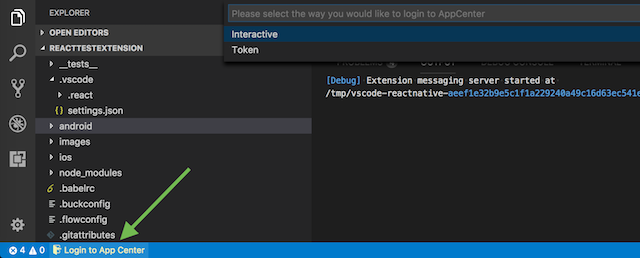
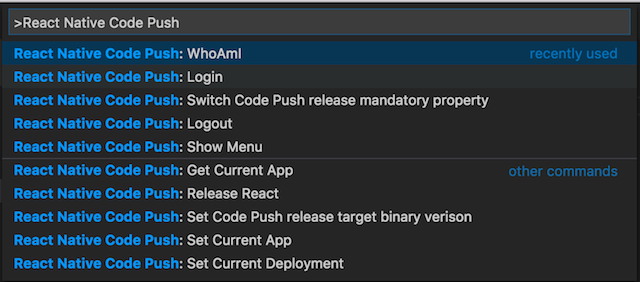

## Using React Native CodePush with current extension

If you have added [react-native-code-push](https://github.com/Microsoft/react-native-code-push) npm package to your `react-native` project you will be able to make CodePush releases directly from the VSCode.

*Note*: You should create an app in [Microsoft AppCenter](https://appcenter.ms/) and configure `react-native-code-push` according to [docs](https://github.com/Microsoft/react-native-code-push#getting-started).

### Logging in to AppCenter

To login to Microsoft AppCenter click on CodePush status bar control and execute login



### Using React Native CodePush commands

From the Command Palette use the React Native Code Push:{Command Name} to run the command



### Using React Native CodePush from status bar

 When you are logged in to AppCenter mostly used commands will be avaliable when clicking on CodePush status bar control

 

 ### Using `codepush.json` for CodePush releases

Please notice that the extension creates `.vscode/codepush.json` file in the project root to store codepush relative data. You could inspect it and change some values manually although we recommend to do it via appropriate `React Native CodePush` commands or via `CodePush` menu in the status bar.

```
{
    "userId": "c4217868-8861-45b9-8f22-0ccc29125841",
    "userName": "user-name",
    "displayName": "display-name",
    "email": "test@aaa.com",
    "defaultApp": {
        "ownerName": "owner-name",
        "appName": "app-name",
        "identifier": "owner-name/app-name",
        "os": "ios",
        "targetBinaryVersion": "",
        "isMandatory": false,
        "currentAppDeployments": {
            "codePushDeployments": [
                {
                    "name": "Staging"
                },
                {
                    "name": "Production"
                }
            ],
            "currentDeploymentName": "Staging"
        }
    }
}
```