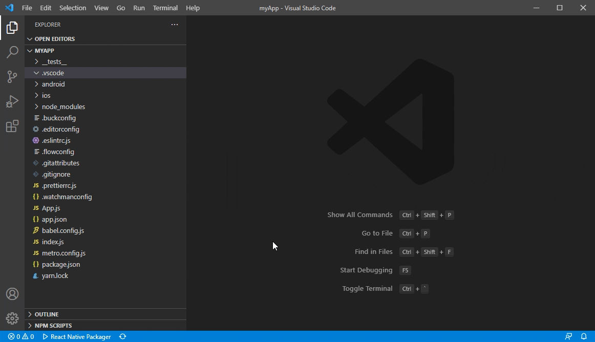

# Run and Debug your React Native application
## Create and run debugging scenario
This extension supports generating debugging configuration in the `.vscode/launch.json` file by selecting debugging parameters in dropdown lists at the top of the editor.

To start debugging, just choose the appropriate configuration in the Configuration dropdown, and then press F5 (or click _Green Arrow_  button) to start debugging your app in VS Code.

The extension also allows to start debugging without creating the `launch.json` file in one of the following ways:
- Using dynamic debugging configurations

    
- Using Debug button in the Editor Title area menu

    

